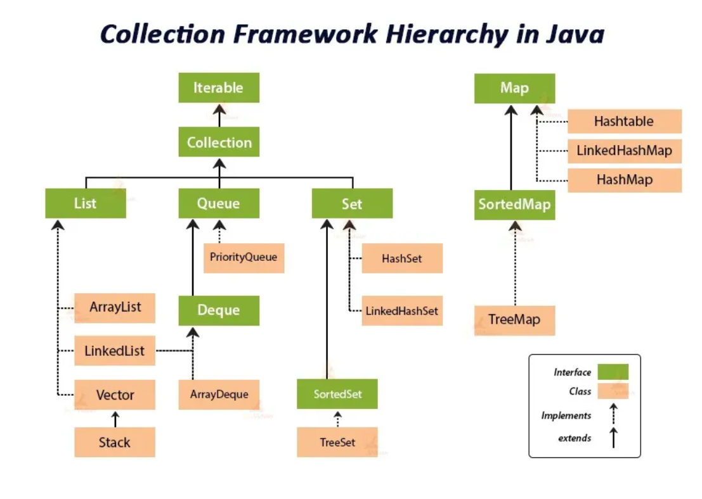

---

# Java泛型 (Generics)

数据类型参数化. 不使用泛型时, 要使用 `Object + instanceof `+ 强制类型转换, 很麻烦. 类型擦除: 泛型仅存在于编译中, 编译之后都会被搞成`Object`.

## 定义泛型

通常使用 `E T K V N ?` 来代表泛型

```java
E // Element 在容器中使用
T // Type 普通的 Java 类
K // Key
V // Value
? // 不确定的类型
```

## 泛型类

```java
public class Resp<T> {
    private T data;
    private String msg;
    private int code;
    
    public void setData(T data) {
        this.data = data;
    }
}
```

## 泛型接口

```java
public interface UserService<T> {
    T login(UsernamePasswordDTO);
}
```

## 泛型方法

```java
public <T> void setName(T name) { ... } // 在方法前定义要使用的泛型
public <T> T getName(T name) { ... }
public static <T> T f(T para) { ... } // 静态方法无法使用类上定义的泛型, 静态方法只能定义泛型方法
```

# Java包装类

```java
// 基本类型 -> 包装类
boolean -> Boolean
char -> Character
---
int -> Integer
long -> Long
float -> Float
double -> Double
byte -> Byte
short -> Short
```

六个数字基本类型的包装类继承了 `Number 抽象类`, 它们实现了抽象方法:

```java
int intValue();
long longValue();
float floatValue();
double doubleValue();
short shortValue();
byte byteValue();
```

以上是实现类型转化的, 例如 `Double d = new Double(3.14)`; `d` 中有 `intValue()` 方法, 可以转为 `int`

```java
Integer int1 = new Integer(1);
Integer int2 = Integer.valueOf(2);  // 推荐

int n1 = int1.intValue();

// String 转 Integer 对象
Integer int3 = new Integer("333");
Integer int4 = Integer.parseInt("999");  // 推荐
Integer int44 = Integer.valueOf("999");

// Integer 转 String
String str1 = int1.toString();

Integer int5 = Integer.MAX_VALUE;
Integer int6 = Integer.MIN_VALUE;
```

## 自动装箱拆箱

```java
Integer a = Integer.valueOf(3); // 装箱
int b = a.intValue(); // 拆箱
```

## 包装类的缓存问题

```java
Integer n1 = 4000;
Integer n2 = 4000;

n1 == n2;  // false
n1.equals(n2);  // true

// 包装类的缓存问题  -128 <= n <= 127  直接取缓存数组中的元素 缓存了 Integer(-128) ... Integer(127), 相当于是一个对象池 (static) 只要使用 Integer, 就会制造一个static的缓存对象池
Integer n3 = 123;
Integer n4 = 123;
n3 == n4;  // true
n3.equals(n4);  // true
```

## 包装类数组的装箱拆箱

### `int[] -> Integer[]`

可以使用 `Arrays.stream()` 方法, 将 `int[]` 转换为流, 并使用 `boxed()` 方法将基本类型 `int` 转换为包装类型 `Integer`, 然后将其转换为数组:

```java
int[] intArray = {1, 2, 3, 4, 5};
Integer[] integerArray = Arrays.stream(intArray).boxed().toArray(Integer[]::new);
```

### `Integer[] -> int[]`

使用 `Arrays.stream()` 方法将 `Integer[]` 转换为流, 然后使用 `mapToInt()` 方法将流中的 `Integer` 元素转换为基本类型 `int`:

```java
Integer[] integerArray = {1, 2, 3, 4, 5};
int[] intArray = Arrays.stream(integerArray).mapToInt(Integer::intValue)/* 或 mapToInt(x -> x) */.toArray();
```

# Java容器 (Collection)

## 各容器关系图



## `interface Iterable`

```java
default void forEach(Consumer<? super T> action);
Iterator<T> iterator();
```

### `interface Iterator`

```java
boolean hasNext();
T next();
void remove();
```

```java
// 使用 iterator 迭代 List
Iterator<String> it = lst.iterator(); // 获取迭代器对象
while (it.hasNext()) it.next();
```

## `interface Collection`

```java
int size();
boolean isEmpty();
void clear();

boolean add(E e);
boolean addAll(Collection<? extends E> c);

boolean contains(Object o);
boolean containsAll(Collection<?> c);

boolean remove(Object o);
boolean removeAll(Collection<?> c);
boolean retainAll(Collection<?> c);

default Stream<E> stream();
Object[] toArray();
default <T> T[] toArray(IntFunction<T[]> generator);
<T> T[] toArray(T[] a);
```

## `interface List`

```java
boolean add(E e);
void add(int idx, E e);
boolean addAll(int index, Collection<? extends E> c);

E get(int idx);
E set(int idx, E e);

E remove(int idx);
default E removeFirst(); // jdk 21
default E removeLast(); // jdk 21

int indexOf(Object o);
int lastIndexOf(Object o);
List<E> subList(int fromIndex, int toIndex);

// jdk 9+, returns an unmodifiable list
static <E> List<E> of();
static <E> List<E> of(E e1);
static <E> List<E> of(E... elements);
// 内容, 长度均不可变
List<String> Notes=List.of("C", "#C/bD", "D", "#D/bE", "E", "F", "#F/bG", "G", "#G/bA", "A", "#A/bB", "B");
```

### `class ArrayList`

底层数组实现, 查询效率高, 增删效率低, 线程不安全

### `class LinkedList`

双链表实现, 查询效率低, 增删效率高, 线程不安全

### `class Vector`

底层数组, 线程安全, 效率低 (所有方法都套上了 synchronized 关键字)

### `class Stack`

线程安全

```java
E peek();
void push(E e);
E pop();
```

## `interface Queue`

```java
boolean add(E e); // 入队, 满则抛异常
boolean offer(E e); // 入队, 满则 return flase

E remove(); // 出队, 空则抛异常
E poll(); // 出队, 空则 return null

E element(); // 获取队头, 空则抛异常
E peek(); // 获取队头, 空则 return null
```

### `class PriorityQueue`

```java
// 默认是小顶堆, 可传入比较器自定义顺序
PriorityQueue<Integer> pq = new PriorityQueue<>((a, b) -> b - a); // 大顶堆
pq.offer(3);
pq.offer(1);
pq.offer(2);
System.out.println(pq.poll()); // 3
```

## `interface Deque`

```java
void addFirst(E e); void addLast(E e); // 入队, 满则抛异常
boolean offerFirst(E e); boolean offerLast(E e); // 入队, 满则 return flase

E removeFirst(); E removeLast(); // 出队, 空则抛异常
E pollFirst(); E pollLast(); // 出队, 空则 return null

E getFirst(); E getLast(); // 获取队头/尾, 空则抛异常
E peekFirst(); E peekLast(); // 获取队头/尾, 空则 return null
```

### `class LinkedList`

允许元素为null

### `class ArrayDeque`

不允许元素为null

## `interface Set`

不可重复, 无序

```java
boolean add(E e);
boolean	addAll(Collection<? extends E> c);

boolean	contains(Object o);
boolean	containsAll(Collection<?> c);

boolean	remove(Object o);
boolean	removeAll(Collection<?> c);
```

### `class HashSet`

插入删除的时间复杂度为$O(1)$

Hash 算法 | 散列算法 | mod n 运算

HashSet 底层是 HashMap, HashMap 底层使用**数组**和**链表**实现存储

当两个元素 Hash 值得到位置相同时, 会调用元素 `equals()` 方法, 如果相同则跳过, 不同则加到链表

数组默认长度是 16, 数组中存储的是单链表

```java
// 使用 HashSet 存储自定义对象
public class User {
    public int id;
    public String username;
    
    // 要重写 hashCode() 和 equals() 以便使用集合存储
    public int hashCode() {
        int code = username == null ? 0 : username.hashCode();
        code = 31 * code + id;
        return code;
    }
    
    public boolean equals(Object o) {
        if (o instanceof User) {
            User user = (User) o;
            return (user.id == this.id) && (user.username == this.username);
        }
        return false;
    }
}
```

### `class LinkedHashSet`

可以保持元素加入集合的顺序 (但不能使用索引访问), 方法与`Set`完全一致

## `interface SortedSet`

```java
Comparator<? super E> comparator();
SortedSet<String> set = new TreeSet<>();
System.out.println(set.comparator()); // 输出: null（使用自然顺序）

E first();
// 返回集合中的第一个(最小)元素(根据排序规则) | 若集合为空抛异常

E last();
// 返回集合中的第一个(最大)元素 | 若集合为空抛异常

SortedSet<E> subSet(E fromElement, E toElement);
// 返回从fromElement(包含)到toElement(不包含)的子集视图
// 返回的子集是原集合的动态视图，对子集的修改会反映到原集合

SortedSet<E> headSet(E toElement);
// 返回从开头到toElement（不包含）的子集视图

SortedSet<E> tailSet(E fromElement);
// 返回从fromElement（包含）到末尾的子集视图
```

### `class TreeSet`

允许对元素排序, 要给定排序规则. 插入删除的时间复杂度为$O(\log n)$.

```java
E ceiling(E e); // 返回大于或等于e的最小元素, 若无则返回null
E floor(E e); // 返回小于或等于e的最大元素, 若无则返回null
E higher(E e); // 返回严格大于e的最小元素, 若无则返回null
E lower(E e); // 返回严格小于e的最大元素, 若无则返回null
E pollFirst(); // 移除并返回第一个元素, 若为空返回null
E pollLast(); // 移除并返回最后一个元素, 若为空返回null
NavigableSet<E> descendingSet(); // 返回逆序视图
Iterator<E> descendingIterator(); //返回逆序迭代器
```

```java
//// 通过元素自身实现比较规则 compareTo() 方法
public class User implements Comparable<User> {
    public Integer id;
    public String username;
    
    @Override
    public int compareTo(User user) {  // 只有实现了 compareTo() 方法的类, 才可以 add 进 TreeSet
        if (this.id < user.id) return -1;
        if (this.id > user.id) return 1;
        return this.username.compareTo(user.username);
    }
    
    // 要有 hashCode 和 equals() 方法
}

//// 通过比较器指定比较规则
public class UserComparator implements Comparator<User> {
    @Override
    public int compare(User u1, User u2) {
        if (u1.id <= u2) return -1; // u1 先于 u2
        return 1;
    }
}

public class Main {
    public static void main(String[] args) {
        Set<User> set = new TreeMap<>(new UserComparator());
    }
}

//// 使用lambda表达式代替指定比较器
Set<User> set = new TreeMap<>((u1, u2) -> u1.id - u2.id);
```

## `interface Map`

```java
int size();
boolean isEmpty();
void clear();

boolean	containsKey(Object key);
boolean	containsValue(Object value);

Set<Map.Entry<K,V>>	entrySet();
Set<K> keySet();
Collection<V> values();

V get(Object key);
default V getOrDefault(Object key, V defaultValue);
V remove(Object key);
default boolean	remove(Object key, Object value);
V put(K key, V value);

// 遍历 Map 的键
for (Integer key : map.keySet()) { ... }

// 遍历 Map 的值
for (String value : map.values()) { ... }

// 遍历 Map 的键值对
for (Map.Entry<Integer, String> entry : map.entrySet()) { sout(entry.getKey(), entry.getValue()); }

// forEach 遍历键值对
map.forEach((key, value) -> sout(key, value));

// Iterator 遍历键值对
Iterator<Map.Entry<Integer, String>> iterator = map.entrySet().iterator();
while (iterator.hasNext()) {
    Map.Entry<Integer, String> entry = iterator.next();
    sout(entry.getKey(), entry.getValue());
}
```

### `class HashMap`

### `class LinkedHashMap`

## `interface SortedMap`

```java
// 补充额外操作
```

### `class TreeMap`

可以对键排序, 要给定Key对象的排序规则

# `Arrays`工具类

```java
// 工具类中所有的方法都是静态方法

static <T> List<T> asList(T... a);

// 八个基本类型都有对应的重载方法
static int binarySearch(int[] a, int key);
static int binarySearch(int[] a, int fromIndex, int toIndex, int key);
static int binarySearch(Object[] a, int fromIndex, int toIndex, Object key);
static int binarySearch(short[] a, int fromIndex, int toIndex, short key);
static <T> int binarySearch(T[] a, int fromIndex, int toIndex, T key, Comparator<? super T> c);
static <T> int binarySearch(T[] a, T key, Comparator<? super T> c);

// newLength 要大于等于original.length, 超出部分补0
static int[] copyOf(int[] original, int newLength);
static <T> T[] copyOf(T[] original, int newLength);

static int[] copyOfRange(int[] original, int from, int to);
static <T> T[] copyOfRange(T[] original, int from, int to);

static boolean deepEquals(Object[] a1, Object[] a2);
static String deepToString(Object[] a); // 打印2D数组时用

static boolean equals(int[] a, int[] a2);
static boolean equals(Object[] a, Object[] a2);

static void	fill(int[] a, int val);
static void	fill(int[] a, int fromIndex, int toIndex, int val);
static void	fill(Object[] a, Object val);
static void	fill(Object[] a, int fromIndex, int toIndex, Object val);

static void	sort(int[] a);
static void	sort(int[] a, int fromIndex, int toIndex);
static void	sort(Object[] a);
static void	sort(Object[] a, int fromIndex, int toIndex);
static <T> void	sort(T[] a, Comparator<? super T> c);
static <T> void	sort(T[] a, int fromIndex, int toIndex, Comparator<? super T> c);

static IntStream stream(int[] array);
static IntStream stream(int[] array, int startInclusive, int endExclusive);
static <T> Stream<T> stream(T[] array);
static <T> Stream<T> stream(T[] array, int startInclusive, int endExclusive);
```

# `Collections`工具类

```java
static <T> boolean addAll(Collection<? super T> c, T... elements);

static <T> int	binarySearch(List<? extends Comparable<? super T>> list, T key);
static <T> int	binarySearch(List<? extends T> list, T key, Comparator<? super T> c);

static <T> void	copy(List<? super T> dest, List<? extends T> src);

static <T> List<T> emptyList();
static <T> Set<T>	emptySet();
static <E> SortedSet<E>	emptySortedSet();
static <K,V> Map<K,V> emptyMap();
static <K,V> SortedMap<K,V>	emptySortedMap();

static <T> void	fill(List<? super T> list, T obj);

static <T extends Object & Comparable<? super T>> T	max(Collection<? extends T> coll);
static <T> T max(Collection<? extends T> coll, Comparator<? super T> comp);
static <T extends Object & Comparable<? super T>> T min(Collection<? extends T> coll);
static <T> T min(Collection<? extends T> coll, Comparator<? super T> comp);

static void reverse(List<?> list);

static void	shuffle(List<?> list);

static <T extends Comparable<? super T>> void sort(List<T> list);
static <T> void	sort(List<T> list, Comparator<? super T> c);

static void	swap(List<?> list, int i, int j);
```

# Array <=> Collection

Java 提供了几种方法将数组转换为集合, 或将集合转换为数组. 以下是常见的 API 和示例代码: 

## 数组转换为集合

使用 `Arrays.asList()` 方法可以将数组转换为集合. 这个方法返回一个 `List`, 不过返回的集合是固定大小的, 无法添加或删除元素. 

```java
public class ArrayToCollection {
    public static void main(String[] args) {
        String[] array = {"Apple", "Banana", "Cherry"};
        
        // 数组转换为集合（List）
        List<String> list = Arrays.asList(array);
        
        System.out.println(list);
    }
}
```

**注意**：使用 `Arrays.asList()` 返回的集合是一个固定大小的 `List`, 不能进行 `add()` 和 `remove()` 操作. 如果需要可变的集合, 可以进一步转换为 `ArrayList`：

```java
List<String> list = new ArrayList<>(Arrays.asList(array));
```

## 集合转换为数组

使用 `toArray()` 方法可以将集合转换为数组：

### 使用 `toArray()` 无参方法

返回一个 `Object[]` 数组：

```java
public class CollectionToArray {
    public static void main(String[] args) {
        List<String> list = new ArrayList<>();
        list.add("Apple");
        list.add("Banana");
        list.add("Cherry");
        
        // 集合转换为数组
        Object[] array = list.toArray();
        
        System.out.println(Arrays.toString(array));
    }
}
```

### 使用 `toArray(T[] a)` 方法

使用指定类型的数组, 可以避免类型转换问题：

```java
String[] array = list.toArray(new String[0]);
```

这里使用一个大小为 0 的数组（`new String[0]`）作为参数, Java 将根据集合的大小自动调整数组大小. 也可以传入指定大小的数组, 如果数组大小足够, 集合元素将放入该数组中. 

**注意**: 对二维List

```java
Integer[][] arr = lst.toArray(new Integer[lst.size()][]);
```

使用这种写法, 返回指定类型 (`Integer[]`) 的数组 (`Integer[][]`)

### 使用 Java 8 的 Stream

Java 8 的 `Stream` API 也可以用来实现数组和集合之间的转换：

#### 数组转换为集合

通过 `Arrays.stream()` 将数组转换为流, 再通过 `collect()` 转换为集合：

```java
List<String> list = Arrays.stream(array).collect(Collectors.toList());
```

#### 集合转换为数组

通过 `Stream` 的 `toArray` 方法转换为数组：

```java
String[] array = list.stream().toArray(String[]::new);
```

### 总结

- 数组转集合：`Arrays.asList()` 或 `Arrays.stream()`
- 集合转数组：`toArray()` 方法或流的 `toArray()` 方法

# `.sort()` 方法

在 Java 中, `Arrays.sort()` , `Collections.sort()`方法允许通过自定义排序来对数组进行排序. 二者几乎无区别.

可以使用 `Comparator` 接口, 也可以用 lambda 表达式来简化代码. 以下是几种常见的用法：

## 使用 `interface Comparator<T>` 接口的自定义排序

我们可以创建一个实现 `Comparator` 接口的类来定义排序规则. 

```java
public class CustomSortExample {
    public static void main(String[] args) {
        String[] names = {"Alice", "Bob", "Charlie"};
        
        // 自定义 Comparator
        Comparator<String> lengthComparator = new Comparator<String>() {
            @Override
            public int compare(String s1, String s2) {
                return Integer.compare(s1.length(), s2.length());
            }
        };
        
        // 使用自定义 Comparator 进行排序
        Arrays.sort(names, lengthComparator);
        System.out.println(Arrays.toString(names));
    }
}
```

## 使用匿名内部类的方式实现 `Comparator`

在不需要单独实现类的情况下, 可以直接使用匿名内部类来定义排序规则：

```java
Arrays.sort(names, new Comparator<String>() {
    @Override
    public int compare(String s1, String s2) {
        return Integer.compare(s1.length(), s2.length());
    }
});
```

```java
class User implements Comparable {
	public int comparaTo(Object o) {  // 要实现的方法 将当前对象和传入的对象比较 如果 this < user, this 在前, 反之 user 在前
        User user = (User) o;
        if (this.score < user.score) return -1;
        if (this.score > user.score) return 1;
        return 0;
    }
}
```

## 使用 Lambda 表达式

在 Java 8 及以上版本中, 可以使用 Lambda 表达式简化代码. Lambda 表达式适合用于简洁地定义 `Comparator`, 如按字符串长度排序：

```java
Arrays.sort(names, (s1, s2) -> Integer.compare(s1.length(), s2.length()));
```

Lambda 表达式还有一个好处就是可以捕获外部的变量 (函数内变量), 类似 Rust, Golang 中的闭包, 例如: 

```java
Map<Integer, Integer> freq = new HashMap<>();
...
Arrays.sort(nums, (n1, n2) -> freq.get(n1) - freq.get(n2)); // 捕获 freq, 按照出现频率排序
```

## 使用 `Comparator.comparing` 方法

Java 8 引入了 `Comparator.comparing()` 方法, 可以更加简洁地定义比较逻辑. 例如, 按字符串长度排序：

```java
Arrays.sort(names, Comparator.comparing(String::length));
```

## 使用 `reversed()` 方法进行反序

如果需要逆序排序, 可以使用 `reversed()` 方法. 例如, 将前面基于字符串长度的排序反转：

```java
Arrays.sort(names, Comparator.comparing(String::length).reversed());
```

## 复杂的自定义排序

可以组合多个排序条件, 例如先按长度排序, 如果长度相同, 再按字母顺序排序：

```java
Arrays.sort(names, Comparator.comparing(String::length).thenComparing(String::compareTo));
```

## 注意:

对于 `Collection`和 `Object[]` 我们可以使用 `.sort()` 方法轻松自定义排序, 但是对于基本类型数组, 如 `int[]`, 我们必须将它先装箱变成 `Integer[]` 后才能自定义排序方法, 不然就只能按照默认从小到大排序. 

# Stream API

## Stream 使用流程

获取 Stream 对象 -> 中间方法 -> 终结方法

### 获取 Stream 对象

**单例集合: `Stream<E> stream()` Collection 接口的方法**

```java
class Draft {
    public void draft() {
        List<String> lst = new ArrayList<String>();
        Collections.addAll(lst, "Bach", "Beethoven", "Mozart", "Handel", "Schubert");
        Stream<String> stream = lst.stream();  // 获取 stream 对象
        stream.forEach(new Consumer<String>() {
            @Override
            public void accept(String s) {
                System.out.println(s);
            }
        });  // stream 一旦被遍历就不能再次遍历

        // stream.forEach(s -> System.out.println(s));

        // stream.forEach(System.out::println);
    }
}
```

**双例集合: 使用 keySet(), entrySet() 转成单例集合**

```java
class Draft {
    public void draft() {
        HashMap<String, Integer> map = new HashMap<>();
        map.put("C", 1);
        map.put("D", 2);
        map.put("E", 3);
        map.put("F", 4);
        map.put("G", 5);
        map.put("A", 6);
        map.put("B", 7);

        map.keySet().stream().forEach(k -> System.out.println(k + " " + map.get(k)));  // 使用 keySet() 获取键

        map.entrySet().stream().forEach(e -> System.out.println(e.getKey() + " " + e.getValue()));  // 使用 entrySet() 获取每一个键值对
    }
}
```

**数组: `Stream<E> stream(T[])`Arrays 工具类中的静态方法**

```java
class Draft {
    public void draft() {
        int[] arr = {3,3,4,5,5,4,3,2,1,1,2,3,3,2,2};
        Arrays.stream(arr).forEach(x -> System.out.println(x));
    }
}
```

**一堆零散数据**

```java
class Draft {
    public void draft() {
        Stream<Integer> stream = Stream.of(3,3,4,5,5,4,3,2,1,1,2,3,3,2,2);
        stream.forEach(x -> System.out.println(x));
    }
}
```

### 中间方法

这些方法改变的是流中的数据, 对集合本身并无影响

**filter()**

```java
class Draft {
    public void draft() {
        ArrayList<String> lst = new ArrayList<>();
        Collections.addAll(lst, "EEFG", "GFED", "CCDE", "EDD-");
        lst.stream().filter(new Predicate<String>() {
            @Override
            public boolean test(String s) {  // true 留下 - false 过滤
                return !s.endsWith("-");
            }
        }).forEach(s -> System.out.println(s));

        lst.stream().filter(s -> !s.endsWith("-")).forEach(s -> System.out.println(s));
        lst.stream().filter(s -> { return !s.endsWith("-"); }).forEach(s -> System.out.println(s));
    }
}
```

**limit() & skip() & distinct()**

```java
class Draft {
    public void draft() {
        int[] arr = {3,3,4,5,5,4,3,2,1,1,2,3,3,2,2};
        Arrays.stream(arr).limit(3).forEach(x -> System.out.println(x));  // 保留前 n 个
        System.out.println("---");
        Arrays.stream(arr).skip(3).forEach(x -> System.out.println(x));  // 跳过前 n 个
        System.out.println("---");
        Arrays.stream(arr).distinct().forEach(x -> System.out.println(x));  // 去重 依赖对象的 hashCode() 和 equals() 方法 底层是 HashSet() 去重
    }
}
```

**concat() - Stream 中的静态方法**

```java
class Draft {
    public void draft() {
        ArrayList<String> lst1 = new ArrayList<>();
        Collections.addAll(lst1, "EEFG", "GFED", "CCDE", "EDD-");
        LinkedList<String> lst2 = new LinkedList<>();
        Collections.addAll(lst2, "GCDEF", "GCC", "AFGAB", "CCC", "FGFED", "EFEDC", "DEDCBC");

        Stream.concat(lst1.stream(), lst2.stream()).forEach(s -> System.out.println(s));
    }
}
```

**map()**

```java
class Draft {
    public void draft() {
        LinkedList<String> lst = new LinkedList<>();
        Collections.addAll(lst, "C-1", "D-2", "E-3", "F-4", "G-5", "A-6", "B-7");
        lst.stream().map(new Function<String, Integer>(/* 第一个泛型表示流中原本的类型, 第二个类型表示要转的类型 */) {
            @Override
            public Integer apply(String s) {
                String[] split = s.split("-");
                return Integer.valueOf(split[1]);
            }
        }).forEach(s -> System.out.println(s));  // 这里的 s 就是 Integer 了

        lst.stream().map(s -> {
            String[] split = s.split("-");
            return Integer.valueOf(split[1]);
        }).forEach(s -> System.out.println(s));

        lst.stream().map(s -> Integer.valueOf(s.split("-")[1])).forEach(s -> System.out.println(s));
    }
}
```

### 终结方法

**遍历 ``void forEach(Consumer action)``**

```java
class Draft {
    public void draft() {
        List<String> lst = new ArrayList<String>();
        Collections.addAll(lst, "Bach", "Beethoven", "Mozart", "Handel", "Schubert");
        lst.forEach(new Consumer<String>() {
            @Override
            public void accept(String s) {
                System.out.println(s);
            }
        });  // stream 一旦被遍历就不能再次遍历

         lst.forEach(s -> System.out.println(s));

         lst.forEach(System.out::println);
    }
}
```

**统计 ``long count()``**

```java
class Draft {
    public void draft() {
        ArrayList<String> lst1 = new ArrayList<>();
        Collections.addAll(lst1, "EEFG", "GFED", "CCDE", "EDD-");
        LinkedList<String> lst2 = new LinkedList<>();
        Collections.addAll(lst2, "GCDEF", "GCC", "AFGAB", "CCC", "FGFED", "EFEDC", "DEDCBC");

        long cnt = Stream.concat(lst1.stream(), lst2.stream()).filter(s -> s.startsWith("G") || s.startsWith("C")).count();  // 注意返回是 long
        System.out.println(cnt);
    }
}
```

**收集到数组 ``toArray()``**

```java
class Draft {
    public void draft() {
        List<String> lst = new ArrayList<String>();
        Collections.addAll(lst, "Bach", "Beethoven", "Mozart", "Handel", "Schubert");

        Object[] array = lst.stream().toArray();  // 这种情况只能返回 Object[]
        System.out.println(Arrays.toString(array));

        // toArray() 参数: 创建一个指定类型的数组
        String[] array1 = lst.stream().toArray(new IntFunction<String[]>(/* 泛型表示你想要的数组类型 */) {
            @Override
            public String[] apply(int value) {  // 参数 value 是数组的长度
                return new String[value];
            }
        });
        System.out.println(Arrays.toString(array1));

        String[] array2 = lst.stream().toArray(value -> new String[value]);
        System.out.println(Arrays.toString(array2));
    }
}
```

**收集到集合 ``collect(Collector collector``**

```java
class Draft {
    public void draft() {
        List<String> lst = new ArrayList<String>();
        Collections.addAll(lst, "Bach-17", "Beethoven-19", "Mozart-18", "Handel-17", "Schubert-19", "Bach-17");

        // 收集到 List
        List<String> list = lst.stream().filter(s -> s.startsWith("B")).collect(Collectors.toList());
        System.out.println(list);
        
        // 收集到 Set
        Set<String> set = lst.stream().filter(s -> s.startsWith("B")).collect(Collectors.toSet());
        System.out.println(set);
        
        // 收集到 Map
        Map<String, Integer> map = lst.stream()
                .filter(s -> s.startsWith("B"))
                .distinct()  // 收集到Map 要确保Key不重复
                .collect(Collectors.toMap(
                        new Function<String, String>() {  // toMap 第一个参数 -> 生成 key 的规则
                            @Override
                            public String apply(String s) {
                                return s.split("-")[0];
                            }
                        },
                        new Function<String, Integer>() {  // toMap 第二个参数 -> 生成 Value 的规则
                            @Override
                            public Integer apply(String s) {
                                return Integer.valueOf(s.split("-")[1]);
                            }
                        }
                ));
        System.out.println(map);

        map = lst.stream()
                .filter(s -> s.startsWith("B"))
                .distinct()
                .collect(Collectors.toMap(
                        s -> s.split("-")[0],
                        s -> Integer.valueOf(s.split("-")[1])
                ));
        System.out.println(map);
        
        // 收集到字符串
        List<String> words = List.of("Hello", "world", "this", "is", "Java");
        // 使用 Stream API 和 Collectors.joining() 来用空格连接字符串
        String result = words.stream().collect(Collectors.joining(" "));

    }
}
```

## toArray() 方法详解

`toArray()` 方法是 Java Stream API 中常用的方法, 用于将流 (`Stream`) 中的元素收集到一个数组中. `toArray()` 方法有两个不同的版本, 分别用于**对象流 (`Stream<T>`)** 和**基本类型流 (如 `IntStream`、`LongStream`、`DoubleStream`)**. 下面详细介绍这两种用法：

### `Stream<T>` 中的 `toArray()`

在 `Stream<T>` 中, `toArray()` 有两种常用形式：

#### `toArray()` 无参方法

这是最简单的形式, 将 `Stream<T>` 中的元素收集到一个 `Object[]` 数组中：

```java
Stream<String> stream = Stream.of("A", "B", "C");
Object[] array = stream.toArray();
```

#### `toArray(IntFunction<A[]> generator)` 方法

这个重载方法接受一个 `IntFunction<A[]>`, 用于生成指定类型的数组. 一般来说, 这个方法可以让我们将流收集到一个特定类型的数组中, 而不仅仅是 `Object[]`: 

```java
Stream<String> stream = Stream.of("A", "B", "C");
String[] array = stream.toArray(String[]::new);
```

这里, `String[]::new` 是一个数组构造引用, 用于生成正确类型的数组. 

**注意**: 这种方法产生不了基本类型数组 !!!

### 基本类型流 (`IntStream`) 中的 `toArray()`

对于基本类型流 (以 `IntStream` 为例) `toArray()` 方法专门返回一个基本类型数组: 

```java
IntStream intStream = IntStream.of(1, 2, 3);
int[] intArray = intStream.toArray();
```

### 基本类型与装箱类的互转

#### `Stream<Object> ` to `int[]`

```java
String[] words = {"apple", "banana", "cherry"};

int[] lengths = Arrays.stream(words)
                      .mapToInt(String::length) // 将每个字符串映射为其长度
                      .toArray(); // 转换为 int[]
```

```java
List<Integer> lst = new ArrayList<>();
Collections.addAll(lst, 1, 2, 3, 4, 5);
int[] arr = lst.stream().mapToInt(Integer::intValue).toArray();
```

#### `IntStream` to `Integer[]`

```java
int[] arr = { 1, 2, 3, 4, 5, 6, 7, 8, 9 };
// Arrays.stream(arr) 是一个 IntStream 对象
Integer[] arrInteger1 = Arrays.stream(arr).mapToObj(Integer::new).toArray(Integer[]::new);
Integer[] arrInteger2 = Arrays.stream(arr).boxed().toArray(Integer[]::new);
```

两种方法把基本数据类型转成装箱类

### 总结

- 对于对象流 (`Stream<T>`), `toArray()` 可以将流元素收集到 `Object[]`, 或者指定类型的数组中. 
- 对于基本类型流 (`IntStream`、`LongStream`、`DoubleStream`), `toArray()` 会返回对应类型的基本数组 (如 `int[]`、`long[]`、`double[]`).
- 使用 `toArray(IntFunction<A[]> generator)` 可以更方便地生成特定类型的数组, 并避免类型转换的麻烦.

# 杂项

## String 及其相关

String (不可变), StringBuilder (可变, 效率高, 线程不安全), StringBuffer (可变, 效率低, 线程安全)

## 二维数组

`type + [][]`

```java
int[][] arr = new int[3][];
arr[0] = new int[2];
arr[1] = {1,2,3};
arr[2] = new int[4];
```

`new int[3][]` 表示: 初始化一个int长度为3类型的数组, 该数组的元素也是 int 类型的数组